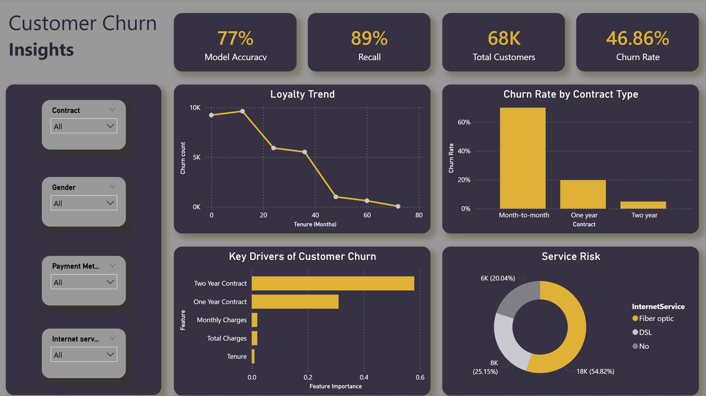
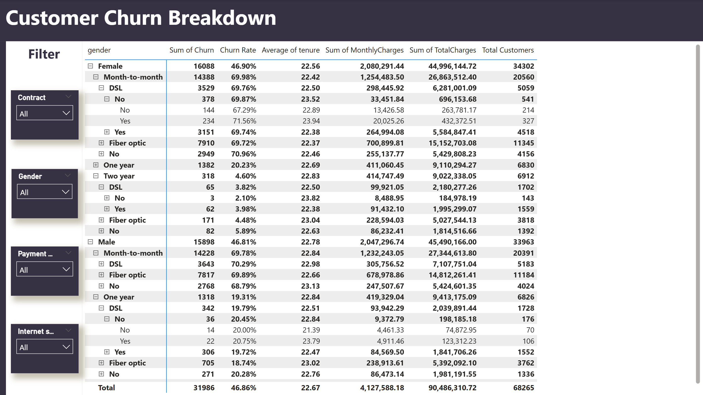

# 📊 Telecom Customer Churn Analysis & Prediction

An end-to-end Data Analysis and Machine Learning project focused on predicting customer churn and supporting business decision-making.

Developed as the final project of a 30-hour Data Analysis training.

---

## 🚀 Project Pipeline

This project covers the full data workflow:

1. Data Cleaning & Preprocessing  
2. Exploratory Data Analysis (EDA)  
3. Machine Learning Modeling  
4. Interactive Power BI Dashboard  

---

## 📂 Project Structure

notebooks/
│── 01_Data_Cleaning.ipynb
│── 02_EDA.ipynb
│── 03_Modeling.ipynb

dashboard/
│── main_dashboard.png
│── detailed_dashboard.png

---

## 📊 Dataset

- 68,000+ customer records  
- 21 features  
- Source: Kaggle Telecom Customer Churn Dataset  

---

## 🤖 Machine Learning Models

- Logistic Regression  
- Random Forest  

### Performance
- Accuracy: 77%
- Recall: 89%

(Recall was prioritized to better detect high-risk churn customers.)

---

## 🔍 Key Insights

- Contract type is the strongest churn driver.
- Month-to-month customers have the highest churn risk.
- Long-term contracts significantly reduce churn probability.
- Pricing and demographics have limited impact.

---

## 📊 Dashboard Preview

---

## 🎯 Business Value

This project demonstrates how data and machine learning can help companies:
- Identify at-risk customers
- Improve retention strategies
- Support data-driven decisions
- 
